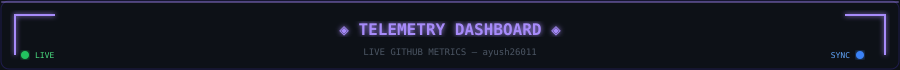

<div align="center">

<!-- HERO BANNER -->


<br/>

[](https://git.io/typing-svg)

<br/>

<!-- SOCIAL BADGES -->

<a href="mailto:tayush2601@gmail.com">
  
</a>
<a href="https://linkedin.com/in/ayush-tiwari-9601a7348">
  
</a>
<a href="https://github.com/ayush26011">
  
</a>

<br/><br/>

<!-- VISITOR BADGE -->


</div>

---

<!-- ANIMATED SHOWCASE GIF -->

<div align="center">
  
  <br/>
  <sub><i>↑ Stored at <code>Assets/output.gif</code></i></sub>
</div>

---

<!-- HUD SECTION DIVIDER (animated SVG — store at Assets/divider.svg) -->
<div align="center">
  
</div>

<div align="center">

[](https://git.io/typing-svg)

</div>

---

## 👋 About Me

<!-- HUD HEADER BANNER (animated SVG — store at Assets/hud_header.svg) -->
<div align="center">
  
</div>

<br/>

```yaml
name: Ayush Tiwari

title:
  - AI/ML Engineer
  - Backend Architect
  - Full Stack Developer

location: Prayagraj, Uttar Pradesh 🇮🇳

currently_building:
  - LLM-powered assistants with RAG & Vector Databases
  - Real-time Computer Vision systems
  - Scalable Backend APIs with FastAPI & Django
  - AI products solving accessibility & civic challenges

experience:
  - Backend Development Intern @ Prodesk IT
  - Elsevier Published Research Author
  - 2× National Hackathon Winner

mission: >
  Transform ambitious ideas into intelligent systems that people
  actually use. I enjoy building products where Machine Learning,
  Software Engineering, and Human Impact intersect.

fun_fact:
  - Trained ML models on 175K+ records
  - Built production APIs serving real-world applications
  - Won hackathons by shipping prototypes in under 24 hours
  - Love turning research papers into deployable products

philosophy: >
  AI is only valuable when it solves a real problem.
  My focus is not just building models — it's building systems
  that are scalable, reliable, and useful.

current_status: "Learning, Building, Researching, Shipping 🚀"
```

### 💡 What Drives Me?

I love working on problems where **intelligence meets engineering**.

Whether it's:

* 🤟 Building a sign-language translator for accessibility
* 🏛️ Creating AI assistants for public services
* 🧠 Designing LLM-powered applications
* ⚡ Optimizing backend systems for scale

My goal remains the same:

> **Build technology that creates measurable impact, not just impressive demos.**

When I'm not coding, you'll probably find me:

* 📚 Reading AI research papers
* 🏆 Participating in hackathons
* 🎤 Organizing tech communities & events
* 🔬 Experimenting with new AI tools and frameworks

### ⚡ Engineering Mindset

<!-- ANIMATED PIPELINE SVG — store at Assets/pipeline.svg -->
<div align="center">
  
</div>

```text
Research → Prototype → Optimize → Scale → Impact
```

I believe great products are built when strong engineering,
continuous learning, and user-centric thinking come together.

<details>
<summary><b>🏆 Career Highlights</b></summary>
<br/>

| Achievement | Details |
|---|---|
| 🥇 **UHack 4.0 Winner** | 1st Place — 500+ participants nationwide |
| 🥇 **Google Build with AI Winner** | LLM-powered civic services assistant |
| 📄 **Elsevier Procedia Published** | AICCT 2025 — 93.78% XGBoost accuracy on 175K+ records |
| 💼 **Backend Intern @ Prodesk IT** | 8+ REST APIs • 30% latency reduction • 40% test coverage increase |
| 🎤 **TEDx Organizer** | United University, Prayagraj |
| 🚀 **HackDiwas 3.0 Co-Lead** | Major hackathon co-organized |
| 🌐 **Social Media Head** | WikiClub UU |

</details>

---

<!-- DIVIDER -->
<div align="center">
  
</div>

## 🔭 Currently Working On

- 🧠 Advanced RAG pipelines and Vector DB-backed LLM apps
- ⚙️ Scaling backend APIs with async FastAPI & PostgreSQL
- 📡 Optimizing real-time inference for computer vision models
- 📚 Writing on AI system design, research, and open-source tooling

---

## 💬 Ask Me About

`Backend Architecture` · `AI / ML Engineering` · `LLMs & Prompt Engineering` · `Django / FastAPI` · `Computer Vision` · `System Design` · `Research Methodology` · `Hackathon Strategy`

---

<!-- DIVIDER -->
<div align="center">
  
</div>

## 🛠️ Tech Stack

<div align="center">

[](https://git.io/typing-svg)

</div>

### ⚙️ Backend
<p align="center">
  
</p>

### 🖥️ Frontend
<p align="center">
  
</p>

### 🤖 AI / ML
<p align="center">
  
  <br/>
  
  
  
  
  
</p>

### 🗄️ Databases
<p align="center">
  
</p>

### ☁️ Cloud & DevOps
<p align="center">
  
</p>

### 🔧 Tools
<p align="center">
  
</p>

---

<!-- DIVIDER -->
<div align="center">
  
</div>

## 🚀 Featured Projects

<div align="center">

[](https://git.io/typing-svg)

</div>

<table>
<tr>
<td width="50%" valign="top">

### 🤟 SignSetu
**AI-Powered Real-Time Sign Language Translator**

> UHack 4.0 🥇 Winner — among 500+ participants

- 📊 **91%+ accuracy** on real-time gesture recognition
- 🗃️ **5,000+ custom samples** in training dataset
- ⚡ Real-time inference with MediaPipe + OpenCV
- 🌐 React frontend with Flask backend


</td>
<td width="50%" valign="top">

### 🏛️ QuickSeva
**LLM-Powered Civic Services Assistant**

> Google Build with AI 🥇 Winner

- 🤖 Conversational AI for government schemes
- 🔍 Gemini API + advanced prompt engineering
- 💬 Multi-turn context-aware assistance
- 🔥 Firebase backend with React frontend


</td>
</tr>
<tr>
<td width="50%" valign="top">

### 🌿 Aarogyam
**Mental Wellness Platform**

- 👥 **100+ active users** since launch
- 🧘 Personalized wellness modules & tracking
- 📱 Responsive cross-platform experience
- 🔒 Secure auth & real-time data sync


</td>
<td width="50%" valign="top">

### 💼 Prodesk IT — Backend Internship
**Production REST API Engineering**

- 🔌 Built **8+ production REST APIs** end-to-end
- ⚡ Reduced API latency by **30%**
- 🚀 Improved backend response time by **25%**
- 🐛 Resolved **15+ production bugs**
- 🧪 Increased test coverage by **40%**


</td>
</tr>
</table>

---

<!-- DIVIDER -->
<div align="center">
  
</div>

## 📄 Research Publication

<!-- ANIMATED RESEARCH BANNER (store at Assets/research_banner.svg) -->
<div align="center">
  
</div>

<br/>

<div align="center">

```
┌─────────────────────────────────────────────────────────────────────┐
│                                                                       │
│   📰  Multi-Class Anomaly Detection in Network Traffic               │
│        Using Supervised Machine Learning                              │
│                                                                       │
│   📚  Publisher  :  Elsevier Procedia Computer Science               │
│   🏛️  Conference :  AICCT 2025                                        │
│   📊  Dataset    :  175,000+ network traffic records                  │
│   🏆  Top Result :  XGBoost — 93.78% Accuracy                        │
│   💡  Key Finding:  Ensemble models outperform linear classifiers     │
│        on high-dimensional traffic data                               │
│                                                                       │
└─────────────────────────────────────────────────────────────────────┘
```

</div>

---

<!-- DIVIDER -->
<div align="center">
  
</div>

## 📊 GitHub Analytics

<!-- ANIMATED ANALYTICS HUD (store at Assets/analytics_hud.svg) -->
<div align="center">
  
</div>

<br/>

<div align="center">


<br/>


<br/><br/>


<br/><br/>

<!-- ACTIVITY GRAPH -->


</div>

---

<!-- DIVIDER -->
<div align="center">
  
</div>

## 🤝 Open Source & Community

<!-- ANIMATED COMMUNITY NETWORK (store at Assets/community_network.svg) -->
<div align="center">
  
</div>

<br/>

<div align="center">

| Community | Role |
|---|---|
| 🔴 **GDG Prayagraj** | Member |
| 🟢 **FOSS Prayagraj** | Contributor |
| 🎤 **TEDx United University** | Organizer |
| 📖 **WikiClub UU** | Social Media Head |
| 🚀 **HackDiwas 3.0** | Lead Organizer |
| 💡 **HackDiwas 2.0** | Organizer |
| 🎯 **Prerogative Pointers** | Executive Member |

</div>

---

<!-- DIVIDER -->
<div align="center">
  
</div>

## 🐍 Contribution Graph

<div align="center">


<!-- HOLOGRAPHIC FRAME via capsule-render -->


<br/>

  

<br/>


</div>


---

<div align="center">

<!-- CAPSULE RENDER SLICE DIVIDER -->


<br/>

[](https://git.io/typing-svg)

<br/>


<sub>
  Designed & built by <strong>Ayush Tiwari</strong> · Prayagraj, India · 2025<br/>
  <a href="mailto:tayush2601@gmail.com">tayush2601@gmail.com</a>
</sub>

</div>
